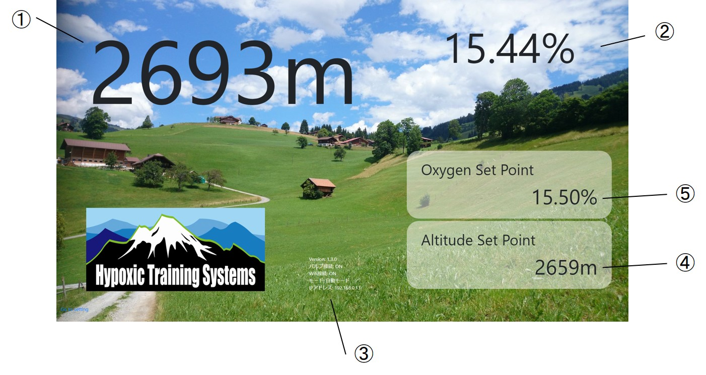
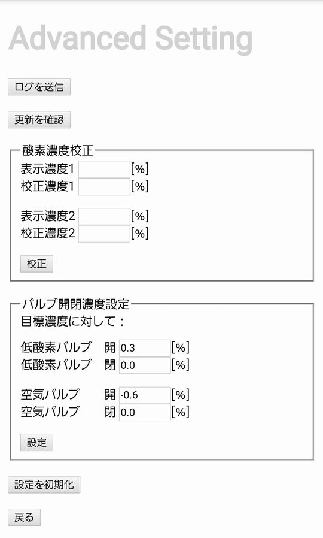

# HypoxicTrainingSystems-help
低酸素トレーニングシステム（以下、本システム）のサポートページです。  

メインコントローラをHDMIディスプレイと接続することで部屋内の酸素濃度・換算高度の表示ができます。  
また、Wifi環境に接続することでユーザ端末（PC/スマートホン/タブレット等）から本システムにアクセスし、遠隔で目標酸素濃度の設定やバルブ操作の開始・停止時間を設定することができます。  
バルブコントローラはメインコントローラとBluetoothで接続され、メインコントローラからの遠隔制御により空気バルブまたは低酸素バルブを操作します。  
ユーザ端末から目標酸素濃度を設定すると、目標濃度に近づくようバルブを自動制御することができます。

バルブには、DC12V仕様のものとAC100V仕様のものがご使用になれます。（AC100Vバルブを使う場合はACバルブ拡張モジュールが必要です）

**【使用バルブ例】**
DC12V：[AB41-03-3-03A-DC12V](https://www.ckd.co.jp/kiki/jp/product/detail/207/AB%E3%83%BBAG%E3%83%BBGAB%E3%83%BBGAG)
AC100V：[AD11-15A-03A-AC100V](https://www.ckd.co.jp/kiki/jp/product/detail/210/AD)

# 更新履歴

| Version |    日付    | 履歴                                                                           |
| :-----: | :--------: | :----------------------------------------------------------------------------- |
| 1.1.1a  | 2021/02/24 | ACバルブ拡張モジュールの説明を追加                                             |
|  1.1.1  | 2021/02/10 | 起動時に前回終了時のバルブ制御モードおよびバルブON/OFF状態を読み出すように修正 |
|  1.1.0  | 2021/02/07 | 画面レイアウトを変更、背景画像を変更                                           |
|  1.0.3  | 2021/01/30 | First Release                                                                  |

# 諸元
|       項目       |         概要          |
| :--------------: | :-------------------: |
|     検知気体     | 酸素（O2） |
| 計測濃度表示範囲 |      5.0 ~ 25.0%      |
|  センサ応答時間  |         <10秒         |
|   使用温度範囲   |      -20 ~ 50度       |
|   使用湿度範囲   |       15 ~ 90%        |
| 画面表示更新間隔 |         10秒          |
|  バルブ制御間隔  |          3秒          |

## 主な機能
- 酸素濃度・換算標高の表示

加えて、Wifiに接続することで、以下の機能が使用できます。
- 目標酸素濃度の設定
- バルブの自動制御・強制ON/OFF
- バルブ自動制御の開始/停止時刻のスケジューリング
- バージョンの更新
- 酸素センサの校正（出荷時に一度校正しています）

# 表示内容詳細

## メイン画面

1. 換算標高
1. 酸素濃度
1. 各種ステータス（IPアドレスは設定から非表示にできます）
1. 換算高度目標（酸素濃度から自動換算）
1. 酸素濃度目標

# 各部詳細
## メインコントローラ

酸素濃度計測、画面表示、ユーザ端末との通信などを行います。
メインコントローラのみを使用することで、酸素濃度表示器として使うことも可能です。

1. 酸素センサ
2. シャットダウンボタン
3. 電源ステータスLED確認穴
4. 電源プラグ（MicroUSB, 5V3A）
5. HDMIプラグ
6. SDカードスロット
7. 壁掛け用穴

## バルブコントローラ
メインコントローラと通信し、バルブを駆動します。
バルブコントローラに直接接続するバルブは、必ずDC12V駆動のものとしてください。

1. 電源プラグ(12V3A)
2. 低酸素バルブ接続端子台
3. 空気バルブ接続端子台
4. 電源ステータスLED（緑）
5. 低酸素バルブステータスLED（赤）
6. 空気バルブステータスLED（赤）
7. メインコントローラ接続ステータスLED（緑）

# 主な使い方

## 接続・電源投入

※どちらのコントローラを先に電源投入しても構いません。

### メインコントローラ
1. （ケーブル接続）HDMIプラグにHDMIケーブルをつなぎ、ディスプレイ（FullHD推奨）と接続します。
2. （電源投入）電源プラグにACアダプタを接続し、電源を入れます。
3. （画面表示）本システムの画面が自動で立ち上がります。立ち上がるのに数分かかります。

※立ち上がってからしばらくは画面がちらつく場合があります。

### バルブコントローラ
1. （バルブ接続）低酸素/空気バルブ接続端子台に各バルブを接続します。バルブに極性がある場合は間違えないよう注意してください。
2. （電源投入）電源プラグにACアダプタを接続し、電源を入れます。電源ステータスLEDが点灯することを確認してください。

※空気・低酸素いずれか片方のみをバルブで操作する場合は、一方のみを接続して使うことができます。

### ACバルブ拡張モジュール
本モジュールを使ってACバルブを操作する場合は下記の手順に従って接続してください。
1. モジュールのふたを開けます。
2. 中に端子台のカバーが入っているので、取り出します。
3. バルブコントローラとモジュールを接続します。バルブコントローラの低酸素バルブ接続端子と、モジュールの側面に「バルブコントローラ」と書いてある側の端子台（4x2）の”H"と書いてある端子を接続します。極性はありません。
4. バルブコントローラの空気バルブ接続端子と、同端子台の”N"と書いてある端子を接続します。極性はありません。
5. 次に、バルブとモジュールを接続します。低酸素用バルブのケーブルをモジュール側面に「バルブ」とある穴から入れ、6x2組端子台の”H"とある端子に接続してください。極性はありません。
6. 空気用バルブのケーブルを同じ穴から入れ、同端子台の”N"とある端子に接続してください。極性はありません。
7. ACケーブルを接続します。「100V」とある穴からケーブルを入れ、同端子台の”AC"とある端子に接続してください。極性はありません。接続の際は必ずケーブルをコンセントから外してください。
8. 端子の保護のため、付属の端子台カバーを取り付け、蓋を閉じます。
9. コンセントをつなぎます。

**【組み付け例】**

※本モジュールを使用する場合は必ずAC100V仕様のバルブをご使用ください。
※本モジュールはAC100Vを取り扱います。不完全な組付け等によるショート、感電等に十分ご注意ください。
※空気・低酸素いずれか片方のみをバルブで操作する場合は、一方のみを接続して使うことができます。

#### 注意
- 各コントローラは直射日光の当たらない場所に設置してください。
- メインコントローラは空気の通りが良い場所に設置してください。
- バルブを長時間ONすると高温になります。長時間ONする運用を行う場合は放熱を考慮してください。

## シャットダウン

### メインコントローラ
1. シャットダウンボタンを長押しします。自動でシャットダウンします。（電源を再投入する場合は、ACアダプタを一度外して、再接続してください。その際、必ず電源ステータスLEDが完全に消灯したことを確認の上、ACアダプタを外してください）

### バルブコントローラ
1. ACアダプタを外してください。

### ACバルブ拡張モジュール
特にシャットダウン手順はありません。

## Wifi接続
酸素濃度/換算標高表示以外の機能を使うには、Wifi接続が必要です。以下の手順でメインコントローラをWifiに接続してください。
1. 電源が入っている場合は、シャットダウンします。
2. 完全にシャットダウンしたことを確認したら、ACアダプタを外します。
3. SDカードスロットからSDカードを外します。手で取りにくい場合は、マイナスドライバーのような細いものでSDカードを取り出してください。その際、力をかけすぎてSDカードを破損しないように気をつけてください。
4. SDカードをPCに接続します。その際、「フォーマットしますか？」といったメッセージが表示される場合がありますが、全て無視してください。
5. [wpa_supplicant.conf](sample/wpa_supplicant.conf)をダウンロードし、ssidとpskをそれぞれお使いのWifiのSSID,パスワードに書き換えてください。（5GHzには対応していません。必ず2.4GHzのWifiをご使用ください）
6. 開いたSDカードのフォルダのトップの階層に、編集したwpa_supplicant.confをコピーします。ファイル名は変えないでください。
7. SDカードをPCから取り出し、メインコントローラに挿入します。
8. 電源を入れます。設定が正しければ、メイン画面に「Wifi接続：ON」、またIPアドレスが表示されます。（IPアドレスは設定から非表示にできます）

## 各種設定

※各種設定を行うには、上述のWifi接続環境が必要です。事前にWifiに接続してください。

## ユーザ端末のメインコントローラ接続

（Android端末以外から接続する場合）
1. ユーザ端末でインターネットブラウザから"hts-1.local"にアクセスします。（ブラウザのURL欄に"hts-1.local"と入力します）
2. 正しくメインコントローラと接続できると、ユーザ端末画面にメイン画面が表示されます。

（Android端末から接続する場合）
1. ユーザ端末でインターネットブラウザからメイン画面に表示されたIPアドレスにアクセスします。（メイン画面に「IPアドレス：192.168.0.11」と表示されていたらブラウザのURL欄に192.168.0.11と入力します）
2. 正しくメインコントローラと接続できると、ユーザ端末画面にメイン画面が表示されます。

※メイン画面にアクセスできず、検索結果等が表示されてしまう場合は、URLの先頭に"http://"を加えてください。   
※「ページにアクセスできません」と表示される場合は、メインコントローラがWifiに接続されていること、URL（IPアドレス）が正しいことを確認してください。

## 設定

ユーザ端末で、「Go to setting」を選択すると設定画面になります。

共通設定：IPアドレス表示のON/OFFを設定できます。

モード設定：バルブ操作の各モードを選択できます。

### 強制モード
目標酸素濃度、現在の酸素濃度に関わらず強制的にバルブをON/OFFするモードです。それぞれのバルブのON/OFFを設定できます。

※長時間ONにするとバルブが高温になります。放熱するか、長時間ONしないようにしてください。

### 自動モード
目標酸素濃度をもとに、自動的にバルブをON/OFFするモードです。  
目標酸素濃度、バルブ自動制御ON/OFFの時刻、曜日を設定できます。

## 拡張設定

バージョンの更新やセンサの校正などを行うことができます。

- ログを送信：動作中のログを送信します。動作トラブルなどの際にお使いください。
- 更新を確認：アプリケーションの更新を確認します。更新があった場合は、確認画面に飛びます。
- 酸素濃度校正：酸素センサの校正を行うことができます。
- 設定を初期化：設定画面上の設定をすべて初期化します。

## 酸素センサの校正方法

出荷時に校正を実施していますが、お使いの環境に応じてセンサの特性が変化する場合があります。そのため、運用開始後に再度校正することをおすすめします。（校正には別途校正された酸素濃度計が必要です）

校正手順は以下のとおりです。
- 部屋を通常の空気で満たした状態で、本システムと酸素濃度計の表示値をメモします。
- 次に、できるだけ酸素濃度を下げた状態で、本システムと酸素濃度計の表示値をメモします。（酸欠にご注意ください）
- 拡張設定画面にて、「表示濃度」に本システムの表示値を、「校正濃度」に酸素濃度計の表示値を入力し、校正ボタンを押してください。（１と２は高濃度側、低濃度側どちらでも構いません）

# 問い合わせ先
Twitter DM等でお問い合わせください

水田かなめ＠[West Gate Laboratory](https://westgate-lab.hatenablog.com/)  
Twitter: [@kmizta](https://twitter.com/kmizta) 
mail: kanamemizuta@gmail.com

